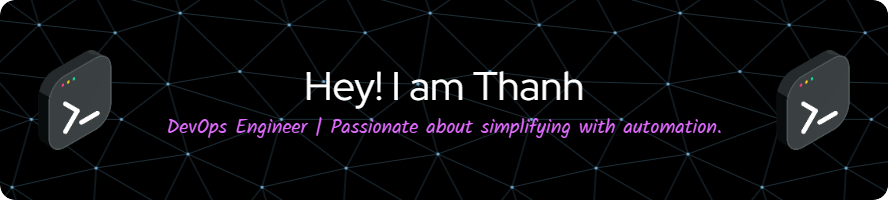

---

### 🌟 Experienced IT Professional Specializing in Cloud, Virtualization, and Data Center Solutions

Welcome to my GitHub profile! I'm a **Platform Engineer | DevOps Automation** specialist with a strong background in **infrastructure, cloud, and automation**.

I'm passionate about **cloud-native technologies** and **automation**, always looking to enhance my skills and contribute to **strategic growth and innovation** in **cloud and DevOps practices**.

🚀 Explore my projects to see my work in **cloud computing, containerization, CI/CD, and infrastructure automation**!

---

### 🔧 Technologies and Tools  
With over a **decade in IT**, I specialize in **designing, implementing, and managing** data center and cloud environments across various platforms. My expertise includes **server infrastructure, storage, virtualization, backup, disaster recovery, and cloud computing**, with deep technical knowledge in **VMware and Public/Private Cloud**.

Currently, I lead an **R&D team at IIJ Global Solutions**, focusing on **building and maintaining high-availability cloud platforms** to ensure seamless **scalability and security** for clients.

#### 🔹 Cloud & Virtualization
- **Cloud**: AWS, Microsoft Azure, VMware Cloud
- **Virtualization**: VMware, KVM, Virtuozzo, Proxmox

#### 🔹 Containerization & Automation
- **Containers**: Docker, Kubernetes
- **CI/CD**: GitLab CI/CD, GitHub Actions, Argo CD
- **Infrastructure as Code**: Ansible, Terraform

#### 🔹 Monitoring & Security
- **Monitoring**: Zabbix, Grafana, Loki, Prometheus, ELK Stack
- **Backup & DR**: Veeam, Acronis, vCloud Director Availability

#### 🔹 Scripting & DevOps
- **Scripting**: Bash, Python
- **Version Control**: GitLab, GitHub

#### 🔹 Infrastructure & Storage
- **Software-Defined Data Center (SDDC)**, VMware Horizon (VDI)
- **Enterprise Hardware**: Dell, HP, Storage Solutions
- **Storage**: Object Storage, SAN, Virtual SAN, NAS
  

### 🌱 I'm currently learning

- Exploring **Golang** to enhance automation tasks and support microservices on **Kubernetes**  
- Deepening my expertise in **GitOps** and **cloud-native** technologies  

### 👯 I'm looking to collaborate on

- Opportunities in **cloud computing, software-defined data center infrastructure, automation, and infrastructure as code**  
- Contributing to **large-scale IT projects** while mentoring and supporting aspiring IT professionals  

---

### 💌 How to reach me

